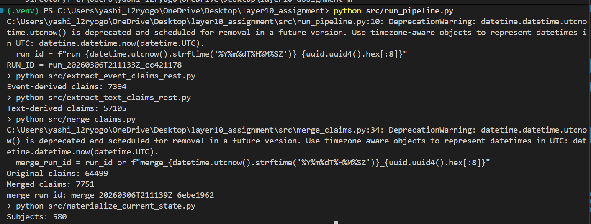
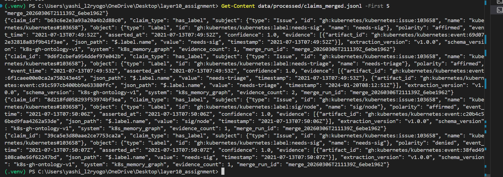
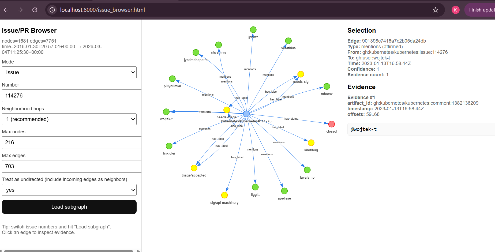
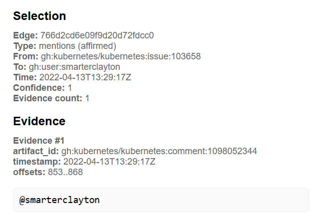
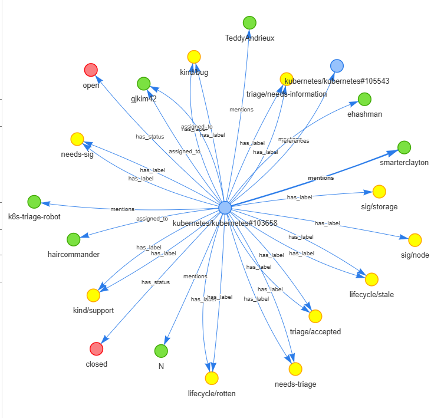

# Memory Graph Extraction System

This project implements a grounded long-term memory system that converts GitHub repository activity into a structured, queryable memory graph. The system extracts entities, relationships (claims), and evidence from issues, pull requests, comments, and timeline events.

The resulting graph allows reliable retrieval of project knowledge while maintaining traceability to original source artifacts.

The design focuses on four core properties:

- grounding  
- reproducibility  
- deduplication  
- maintainability over time  

---

# System Architecture

The pipeline transforms repository activity into structured memory using the following stages:

```
GitHub API
    ↓
Raw Artifacts
    ↓
Normalization
    ↓
Claim Extraction
    ↓
Claim Deduplication
    ↓
Current State Materialization
    ↓
Memory Graph Construction
    ↓
Visualization
```

Each stage produces deterministic outputs so the entire pipeline can be re-executed safely and reproducibly.

---

# Ontology

The memory graph is built using a simple ontology consisting of entities, artifacts, claims, and evidence.

## Entities

Entities represent real objects within the repository ecosystem.

Examples:

- Issue  
- Pull Request  
- Person  
- Label  

---

## Artifacts

Artifacts represent immutable records retrieved from the source system. These artifacts provide the evidence base for extracted knowledge.

Examples:

- Issue body  
- Pull request description  
- Comment  
- Timeline event  

Artifacts contain fields such as:

```
artifact_id
artifact_kind
text
timestamp
```

Artifacts are treated as immutable references to preserve provenance.

---

## Claims

Claims represent relationships extracted between entities. They form the edges of the memory graph.

Examples:

```
Issue → has_label → Label
Issue → mentions → Person
PullRequest → references → Issue
```

---

## Evidence

Every claim must include evidence pointing to the source artifact from which it was extracted.

Evidence contains:

```
artifact_id
quote
start_offset
end_offset
timestamp
```

---

# Extraction Contract

The extraction pipeline follows strict rules to ensure consistency.

Rules enforced by the system:

1. Every claim must reference at least one evidence record.  
2. Claims must contain subject entity, object entity, claim type, and timestamps.  
3. Claim identifiers are generated deterministically using hashing.

Example claim identifier generation:

```
claim_id = sha256(subject_id + object_id + claim_type + artifact_id)
```

This ensures extraction is idempotent and safe to rerun without introducing duplicates.

---

# Deduplication Strategy

Multiple artifacts may express the same relationship. Deduplication prevents redundant edges in the memory graph.

Claims are deduplicated using the signature:

```
(subject_id, object_id, claim_type)
```

Claims with identical signatures are merged and their evidence sets combined.

Example:

```
Issue → has_label → bug
```

If two timeline events both indicate that the label was applied, the system merges them into a single claim with multiple evidence entries.

This produces a clean graph structure while preserving all supporting evidence.

---

# Time Semantics

The system tracks two different timestamps.

**Event Time:** when the action occurred in the source system.

Examples:

- label applied  
- comment posted  
- pull request merged  

**Assertion Time:** when the extraction system observed the claim.

Tracking both allows historical reconstruction and reasoning over repository evolution.

---

# Update Semantics

The system is designed for long-term operation.

**Idempotent extraction**  
Deterministic claim identifiers ensure repeated pipeline runs do not introduce duplicates.

**Incremental ingestion**  
New artifacts can be appended and processed without reprocessing the entire dataset.

**Deletion and redaction handling**  
If artifacts are removed or redacted in the source system, the system can invalidate or flag affected claims.

This preserves the integrity of stored memory.

---

# Visualization

The memory graph can be explored through a lightweight interactive visualization.

The visualization enables:

- exploration of entities and relationships  
- inspection of issue-centered subgraphs  
- viewing of supporting evidence for each claim  
- auditing of merged claims and deduplication behavior  

This layer improves transparency and debugging of extracted knowledge.

---

# Reproducibility

The pipeline can be executed end-to-end using the following steps.

---

## 1. Clone the Repository

Clone the project and navigate into the directory.

```bash
git clone <repository_url>
cd layer10_assignment
```

---

## 2. Create a Python Virtual Environment

It is recommended to run the project in an isolated environment.

```bash
python -m venv .venv
```

Activate the environment.

**Windows**

```bash
.venv\Scripts\activate
```

**Mac/Linux**

```bash
source .venv/bin/activate
```

---

## 3. Install Dependencies

Install the required Python packages.

```bash
pip install -r requirements.txt
```

Typical dependencies include:

- requests  
- tqdm  
- pyvis  

---

## 4. Set the GitHub API Token

The pipeline downloads data from the GitHub API, which requires authentication to avoid rate limits.

Create a GitHub Personal Access Token and set it as an environment variable.

**Windows PowerShell**

```bash
$env:GITHUB_TOKEN="your_github_token"
```

**Mac/Linux**

```bash
export GITHUB_TOKEN="your_github_token"
```

---

## 5. Download the Corpus

Download issues, pull requests, comments, and timeline events from the Kubernetes repository.

```bash
python src/download_k8s_rest.py
```

This step retrieves repository activity from the GitHub REST API and stores it locally.

Output directory:

```
data/raw/
```

Files produced:

```
data/raw/issues.jsonl
data/raw/prs.jsonl
data/raw/comments/
data/raw/timeline/
```

---

## 6. Normalize Raw Artifacts

Convert the raw GitHub responses into a unified artifact format.

```bash
python src/normalize_rest_artifacts.py
```

Artifacts represent the source records from which claims will be extracted.

Output:

```
data/processed/artifacts.jsonl
data/processed/comments.jsonl
data/processed/events.jsonl
```

---

## 7. Extract Event-Based Claims

Extract structured relationships from timeline events such as label additions and assignments.

```bash
python src/extract_event_claims_rest.py
```

Examples of extracted claims:

- Issue has_label Label  
- Issue assigned_to Person  

Output:

```
data/processed/claims_events.jsonl
```

---

## 8. Extract Text-Based Claims

Extract claims from unstructured text within issues, pull requests, and comments.

This stage detects:

- user mentions (`@username`)  
- issue references (`#123`)  
- fix references (`fixes #123`, `closes #123`)  

Run:

```bash
python src/extract_text_claims_rest.py
```

Output:

```
data/processed/claims_text.jsonl
```

---

## 9. Merge Duplicate Claims

Combine claims that represent the same relationship but were extracted from multiple artifacts.

```bash
python src/merge_claims.py
```

Deduplication uses the signature:

```
(subject_id, object_id, claim_type)
```

Merged claims accumulate evidence records.

Output:

```
data/processed/claims_merged.jsonl
```

---

## 10. Materialize Current State

Compute the current state of each issue based on the extracted claims.

This stage determines:

- current labels  
- current assignees  
- issue status  

Run:

```bash
python src/materialize_current_state.py
```

Output:

```
data/processed/current_state.jsonl
```

---

## 11. Build the Memory Graph

Construct a graph representation of entities and relationships from the merged claims.

```bash
python src/build_memory_graph.py
```

The graph connects:

- Issues  
- Pull Requests  
- People  
- Labels  

Edges correspond to extracted claims.

---

## 12. Generate Visualization

Create an interactive graph visualization.

```bash
python src/viz_pyvis_issue_graph.py
```

This generates an HTML visualization using PyVis.

Output:

```
viz/issue_graph.html
```

---

## 13. View the Graph

Open the visualization in a browser.

```
viz/issue_graph.html
```

The interface allows you to:

- explore relationships between issues and entities  
- inspect edges (claims)  
- view supporting evidence extracted from artifacts  

---

# Expected Outputs

After running the full pipeline, the following key files should exist.

```
data/raw/                      # downloaded GitHub artifacts
data/processed/artifacts.jsonl
data/processed/claims_events.jsonl
data/processed/claims_text.jsonl
data/processed/claims_merged.jsonl
data/processed/current_state.jsonl
viz/issue_graph.html          # interactive visualization
```
# System Demonstration















